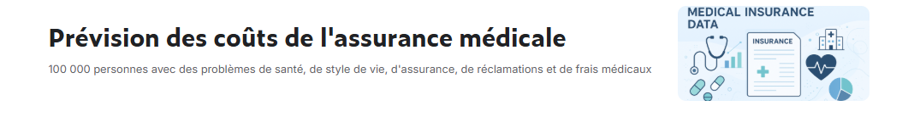

## Prédiction des dépenses médicales et analyse des profils de risque à partir de données démographiques et socioéconomiques

### Contexte du projet
Le secteur de la santé produit aujourd’hui une quantité massive de données sur les individus : âge, sexe,revenu, region, état de santé,
couverture d’assurance, etc.
 Ces informations sont précieuses pour les compagnies d’assurance et les organismes de santé, car elles permettent d’identifier les
facteurs qui influencent le coût des soins médicaux et d’anticiper les dépenses futures.
Dans ce contexte, l’utilisation de méthodes d’analyse de données et de modélisation statistique devient un atout essentiel pour mieux
comprendre le comportement médical des assurés, évaluer les risques et optimiser la tarification des assurances santé.
