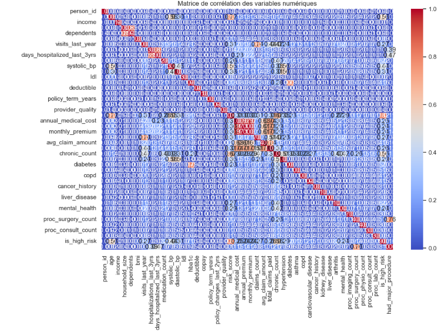
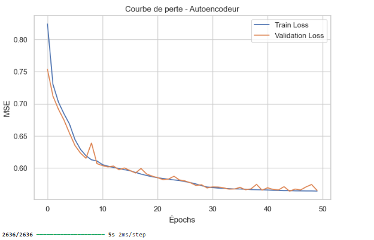
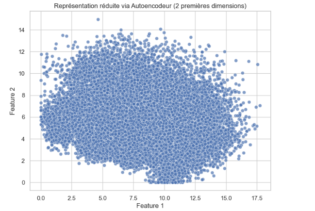
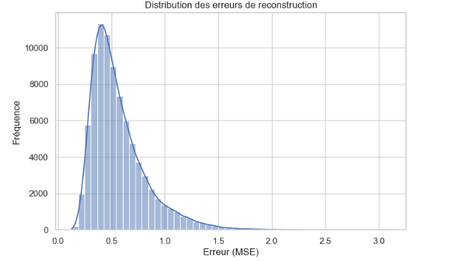
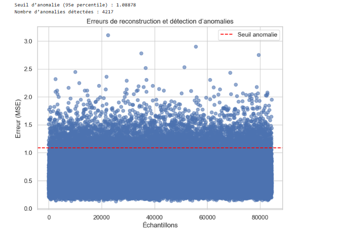

## Prédiction des dépenses médicales et analyse des profils de risque à partir de données démographiques et socioéconomiques
Source De Donnees https://www.kaggle.com/datasets/mohankrishnathalla/medical-insurance-cost-prediction


<p style='text-align: center; font-style: italic; color: #7f8c8d;'>
</p>

## Contexte du projet
Le système de santé en Haïti fait face à de nombreux défis structurels et économiques qui affectent directement l’accès, la
qualité et la gestion des soins médicaux.
La majorité de la population haïtienne dispose de ressources financières limitées, tandis que le coût des soins, des
médicaments et des services hospitaliers reste relativement élevé.
Dans ce contexte, les dépenses de santé représentent un fardeau important pour les ménages, en particulier pour les
personnes atteintes de maladies chroniques telles que l’hypertension, le diabète ou les maladies cardiaques.
Cependant, le secteur de l’assurance santé en Haïti reste encore peu développé et manque d’outils modernes de gestion des
risques et de prévision des coûts.
Les compagnies d’assurance, les hôpitaux et les autorités sanitaires manquent souvent de données consolidées pour analyser
les dépenses médicales, identifier les facteurs de risque et anticiper les coûts futurs.
## Contexte
C’est dans ce cadre que s’inscrit le présent projet :
 il vise à exploiter les données de santé et socioéconomiques des individus pour prédire les dépenses médicales annuelles et
évaluer les profils de risque.
 Grâce aux outils d’analyse de données et aux techniques de machine learning, ce projet fournit une base scientifique pour :
● améliorer la planification des budgets médicaux,
● renforcer la prévention et la couverture santé,
● et appuyer les décisions stratégiques des acteurs du secteur.
## Problématique
Les coûts médicaux varient fortement d’un individu à un autre. Cette variation dépend de nombreux éléments : âge, sexe,revenu,
region, état de santé, couverture d’assurance, etc.
 La question centrale du projet est donc :
Comment prédire les dépenses médicales annuelles d’un individu à partir de ses caractéristiques personnelles,
économiques et médicales ?
## Objectifs du projet
- Développer un modèle capable d’estimer les dépenses annuelles par patient.
Identifier les variables les plus influentes sur les coûts, telles que l’âge, l’IMC, le statut de fumeur ou le nombre de visites médicales.
-Regrouper les patients selon des caractéristiques médicales et démographiques similaires.
Identifier les groupes à haut risque pour cibler la prévention et l’allocation des ressources.
-Comparer plusieurs modèles de machine learning (régression linéaire, Random Forest, XGBoost, Logistic Regression) pour sélectionner celui
offrant la meilleure performance.
Utiliser des métriques complètes : précision (accuracy), rappel (recall), score F1, matrice de confusion, AUC, R² et RMSE
-Représenter la structure des clusters via PCA 2D/3D, UMAP.
Créer des boxplots, heatmaps et graphiques interactifs pour comprendre la distribution des coûts et des caractéristiques par cluster.
-Prévoir les coûts pour les assureurs et hôpitaux.
Segmentation pour la prévention ciblée et la planification des traitements.
Allocation optimale des ressources médicales selon le risque.
Surveillance de la santé des populations à haut risque et contribution indirecte à la lutte contre les maladies chroniques ou infectieuses, comme le
VIH.
## À propos de l'ensemble de données
Cet ensemble de données fournit des informations sur 100 000 personnes, notamment sur leurs données démographiques,
leur statut socio-économique, leur état de santé, leurs facteurs de style de vie, leurs régimes d’assurance et leurs dépenses
médicales.
À propos de ce fichier
Ce fichier contient :
**Lignes : **100 000
**Colonnes : **54+


## Exploration et compréhension du jeu de données
Cette phase d’exploration permet donc de :
● Comprendre la structure et la composition du jeu de données.
● Identifier les principales caractéristiques statistiques des variables.
● Détecter les problèmes de qualité des données, comme les valeurs manquantes ou les anomalies.
Ces vérifications sont essentielles pour garantir la fiabilité des résultats et assurer la réussite des étapes suivantes d’analyse et
de modélisation.
## Compréhension analytique
Le projet permet de réaliser plusieurs approches analytiques :
● Régression : prédire les dépenses médicales selon les caractéristiques des individus.

● Classification : attribuer un niveau de risque (faible, moyen, élevé).

● Clustering : regrouper les individus par similarité de profil santé.

● Analyse exploratoire : étudier les corrélations entre les variables et les coûts.

● Analyse de corrélation approfondie: Il serait intéressant d’étudier plus en détail les relations entre les différentes variables du jeu de données

● Analyse de la variance (ANOVA) : comparer les moyennes de dépenses médicales entre différents groupes d’individus : par exemple selon le type
d’assurance, le sexe, la région, ou la présence de maladies chroniques.

● Importance des variables et analyse de sensibilité : évaluer le poids de chaque facteur dans la prédiction du coût médical.

## Intérêt pour le domaine de la santé
Ce type d’analyse peut aider à :

● Identifier les comportements à risque pour la santé.

● Comprendre comment certains facteurs influencent les coûts médicaux.

● Développer des politiques d’assurance plus justes et adaptées.

● Promouvoir la prévention et la sensibilisation à la santé.
● Une carte de corrélation (ou heatmap) permettrait de visualiser ces liens et d’identifier les facteurs les plus liés aux
dépenses de santé.

● Cela permettrait de déterminer si les différences observées entre les groupes sont statistiquement significatives.

● Une analyse de sensibilité permettra aussi d’évaluer comment de petites variations dans les données (comme une légère
hausse de l’IMC) impactent le coût estimé.

## Modélisation

### Régression:
Pour prédire les dépenses médicales annuelles.
- Régression linéaire
- Random Forest Regressor
- XGBoost Regressor
## Classification:
Pour classer les individus selon leur niveau de risque (faible, moyen, élevé).
-Logistic Regression
-Decision Tree / Random Forest
-Support Vector Machine (SVM)
## Modélisation
### Clustering:
Pour regrouper les individus selon leurs profils de santé
### K-Means
### DBSCAN

### Analyse exploratoire des coûts médicaux
```python
# Visualisations simples
# ------------------------------
# Histogramme du coût médical annuel
plt.figure(figsize=(8,5))
sns.histplot(df['annual_medical_cost'], bins=50, kde=True)
plt.title("Distribution des coûts médicaux annuels")
plt.xlabel("Coût annuel")
plt.ylabel("Nombre de personnes")
plt.show()
```


<p style='text-align: center; font-style: italic; color: #7f8c8d;'>
</p>

### Distribution des coûts médicaux annuels
Ce graphique montre la répartition des dépenses médicales annuelles dans l’ensemble du jeu de données.
Chaque barre représente le nombre de personnes dont les dépenses se situent dans une certaine plage de coûts.
Interprétation:
La plupart des individus dépensent relativement peu en soins médicaux chaque année, mais une minorité présente des coûts très élevés,
souvent liés à des maladies chroniques ou à des hospitalisations importantes


### Coût moyen selon le statut de fumeur
```python

# Coût moyen par statut fumeur
plt.figure(figsize=(6,4))
sns.barplot(x='smoker', y='annual_medical_cost', data=df)
plt.title("Coût moyen selon le statut de fumeur")
plt.show()

```

<p style='text-align: center; font-style: italic; color: #7f8c8d;'>
</p>

### Coût moyen selon le statut de fumeur
Ce graphique compare le coût médical moyen entre les fumeurs et les non-fumeurs.
Chaque barre correspond à la dépense moyenne d’un groupe.
Interprétation:
On observe généralement que les fumeurs ont des coûts médicaux moyens plus élevés que les non-fumeurs.
Cela peut s’expliquer par un risque accru de maladies respiratoires, cardiovasculaires ou cancéreuses, entraînant des soins plus coûteux

### Corrélation entre les variables numériques
```python
# ------------------------------
# Corrélation avancée (variables numériques)
# ------------------------------
numeric_cols = df.select_dtypes(include=['int64', 'float64']).columns
corr_matrix = df[numeric_cols].corr()

plt.figure(figsize=(12,8))
sns.heatmap(corr_matrix, annot=True, fmt=".2f", cmap="coolwarm")
plt.title("Matrice de corrélation des variables numériques")
plt.show()

```

<p style='text-align: center; font-style: italic; color: #7f8c8d;'>
</p>

## Interprétation
L’objectif de cette étape est d’examiner les relations linéaires entre les différentes variables numériques du jeu de
données.
Cette analyse permet d’identifier les variables fortement corrélées entre elles, ce qui aide à comprendre les interactions
potentielles et à éviter la redondance lors de la modélisation.
Interprétation des résultats :
La matrice de corrélation obtenue permet d’identifier :

● Les variables fortement corrélées positivement, qui évoluent dans le même sens.

● Les variables corrélées négativement, qui évoluent en sens inverse.

● Les variables indépendantes, qui présentent peu ou pas de relation.


### Analyse et traitement des valeurs extrêmes (Outliers)
L’objectif de cette étape est d’identifier et corriger les valeurs anormales présentes dans le jeu de données. Ces valeurs,
appelées outliers, sont des observations qui s’éloignent fortement de la majorité des autres. Dans le contexte des coûts
médicaux, elles peuvent correspondre à des individus ayant des dépenses exceptionnellement élevées ou faibles.
### Analyse exploratoire approfondie
Après le nettoyage et la préparation des données, une analyse exploratoire approfondie a été réalisée afin de mieux
comprendre les relations entre les principales variables du jeu de données.
 Cette étape vise à visualiser les tendances, les corrélations et les interactions entre les facteurs démographiques, le mode
de vie et les dépenses médicales annuelles.
 ## Relation entre âge, coût médical, tabagisme et indice de masse corporelle (BMI)

```python
# ------------------------------
# Pairplot pour visualisation multi-variables
# ------------------------------
cols_to_plot = ['age', 'bmi', 'income', 'visits_last_year', 'annual_medical_cost']
sns.pairplot(df[cols_to_plot + ['smoker']], hue='smoker', diag_kind='kde', palette='Set2')
plt.show()

```


<p style='text-align: center; font-style: italic; color: #7f8c8d;'>
</p>

La première visualisation est un nuage de points interactif où :
● l’axe des x représente l’âge des individus,

● l’axe des y indique le coût médical annuel,

● la couleur distingue les fumeurs et non-fumeurs,

● la taille des points correspond à l’indice de masse corporelle (BMI).
## Interprétation :
● On observe que les fumeurs ont en moyenne des coûts médicaux plus élevés, surtout à partir d’un certain âge.

● Les individus avec un BMI élevé (surpoids) ont également tendance à avoir des dépenses supérieures.

● Cela montre une interaction importante entre le tabagisme, l’âge et l’obésité dans la variation des coûts médicaux.

## Comparaison des coûts médicaux selon le statut de fumeur et le sexe
### Interprétation :
● Les fumeurs, quel que soit le sexe, présentent une médiane de coût significativement plus élevée.

● On note également une variabilité plus importante chez les fumeurs, ce qui peut indiquer des risques de santé plus
diversifiés.

● Chez les non-fumeurs, la distribution est plus stable et les coûts restent généralement modérés.

## Carte de corrélation interactive
### Interprétation :
● Le coût médical annuel est fortement corrélé avec le statut de fumeur, le BMI et parfois le revenu.

● L’âge joue également un rôle non négligeable, mais moins déterminant que le tabagisme.

● Ces corrélations confirment les résultats visuels précédents et orientent les variables à privilégier pour la modélisation

## relation entre le coût médical, l’âge, le tabagisme et les catégories de BMI

Cette section vise à approfondir l’étude des dépenses médicales en intégrant un facteur essentiel de santé : l’indice de masse corporelle
(BMI).
L’objectif est d’observer comment le poids corporel influence la relation entre l’âge, le statut de fumeur et le coût médical annuel.
 Interprétation des résultats:
● Dans les catégories Overweight et Obese, les coûts médicaux augmentent nettement avec l’âge, surtout chez les fumeurs.

● Les personnes obèses et fumeuses présentent les plus fortes dépenses médicales dans presque toutes les tranches d’âge.

● Les individus ayant un poids normal conservent en général des coûts stables, sauf en cas de tabagisme prolongé.

● Chez les personnes Underweight, la tendance est plus variable, mais les coûts restent globalement plus faibles

## Évaluation et comparaison rapide des modèles de régression
L’objectif de cette section est d’évaluer la performance de plusieurs modèles de régression pour prédire le coût médical annuel en
fonction des caractéristiques des individus (âge, sexe, statut de fumeur, BMI, revenu, etc.).
 Cette approche permet d’identifier le modèle le plus performant et le plus fiable pour une utilisation pratique.
## Modélisation et évaluation des modèles de classification
L’objectif de cette partie est de prédire si un individu présente un risque élevé de coûts médicaux (is_high_risk = 1) à partir de
ses caractéristiques (âge, revenu, statut de fumeur, etc.).
Cette étape permet de comparer plusieurs modèles d’apprentissage automatique et de sélectionner celui qui donne les
meilleures performances prédictives.

## Trois algorithmes de classification ont été choisis pour la comparaison :


## Évaluation des performances
Après optimisation, chaque modèle est évalué sur le jeu de test avec plusieurs indicateurs :
● Accuracy : proportion de bonnes prédictions.

● F1 Score : équilibre entre précision et rappel.

## Résultats
Après évaluation, les trois modèles (Régression Logistique, Random Forest et XGBoost) présentent des scores de performance très
similaires, notamment au niveau du F1-score et du ROC-AUC.
 Cela suggère que le jeu de données contient des relations relativement simples entre les variables explicatives et la variable cible.
 Dans ce cas, un modèle plus simple comme la Régression Logistique pourrait être privilégié, car il est :
● plus rapide à entraîner,
● plus interprétable,
● et plus facile à déployer dans un contexte réel, par exemple au sein d’un système de santé en Haïti.

● Precision : fiabilité des prédictions positives.

● Recall : capacité à détecter correctement les cas à risque.

● ROC-AUC : mesure de la capacité du modèle à distinguer les classes

### Visualisation via PCA 2D

```python
# PCA 2D (visualisation légère)
# ------------------------------
pca = PCA(n_components=2, random_state=42)
X_pca = pca.fit_transform(X_scaled)
plt.scatter(X_pca[:,0], X_pca[:,1], c=labels_km, cmap='viridis', alpha=0.6, s=20)
plt.title("Clusters KMeans (PCA 2D)")
plt.show(block=False)
plt.pause(0.5)
plt.close()

```

<p style='text-align: center; font-style: italic; color: #7f8c8d;'>
</p>
Principe : réduction des dimensions avec PCA pour représenter les données en 2D.
Les individus sont affichés en couleur selon leur cluster KMeans.

### Interprétation :
● Permet de visualiser les clusters et leur séparation globale.

● Utile pour présenter les résultats aux parties prenantes.

### Analyse des moyennes par cluster

Calcul des moyennes des variables clés (age, bmi, income, annual_medical_cost) pour chaque cluster.
Visualisation via heatmap.
Permet d’identifier les profils types : par exemple, un cluster peut représenter des individus jeunes à faible coût, un autre des
personnes âgées avec coûts élevés.

### Solutions et Recommandations
À la suite des différentes analyses exploratoires et des modèles de machine learning (régression, classification et clustering),
plusieurs solutions concrètes et applicables peuvent être proposées aux acteurs du secteur de la santé et de l’assurance.
### Solutions pour les parties prenantes:
Assureurs : prédire clients à risque élevé → ajustement primes.
Hôpitaux et centres de santé : cibler programmes de prévention pour clusters à risque.
Institutions publiques : allocation efficace du budget santé.
Détection d’anomalies : identifier individus à profil atypique → prévention ciblée.
Ces solutions visent à optimiser les coûts médicaux, améliorer la gestion du risque et favoriser une meilleure prise de
décision stratégique.

## Visualisation
```python
# Deep Learning / Autoencodeur


# ===============================
# Préparation des données
# ===============================

# On suppose que df_encoded contient les variables numériques et normalisées
X = df_encoded.drop(columns=['annual_medical_cost'], errors='ignore')
scaler = StandardScaler()
X_scaled = scaler.fit_transform(X)

# Split train/test
X_train, X_test = train_test_split(X_scaled, test_size=0.2, random_state=42)

# ===============================
# Construction de l’autoencodeur
# ===============================

input_dim = X_train.shape[1]
encoding_dim = 8  # nombre de neurones dans la couche centrale (dimension réduite)

# Architecture de l'autoencodeur
input_layer = Input(shape=(input_dim,))
encoder = Dense(32, activation='relu')(input_layer)
encoder = Dense(16, activation='relu')(encoder)
bottleneck = Dense(encoding_dim, activation='relu', name="bottleneck")(encoder)
decoder = Dense(16, activation='relu')(bottleneck)
decoder = Dense(32, activation='relu')(decoder)
output_layer = Dense(input_dim, activation='linear')(decoder)

autoencoder = Model(inputs=input_layer, outputs=output_layer)
autoencoder.compile(optimizer=Adam(learning_rate=0.001), loss='mse')

# ===============================
# Entraînement du modèle
# ===============================
history = autoencoder.fit(
    X_train, X_train,
    epochs=50,
    batch_size=64,
    validation_data=(X_test, X_test),
    verbose=1
)

# ===============================
# Visualisation de la courbe d’entraînement
# ===============================
plt.figure(figsize=(8,5))
plt.plot(history.history['loss'], label='Train Loss')
plt.plot(history.history['val_loss'], label='Validation Loss')
plt.title("Courbe de perte - Autoencodeur")
plt.xlabel("Épochs")
plt.ylabel("MSE")
plt.legend()
plt.grid(True)
plt.show()

# ===============================
# Réduction de dimension (via couche bottleneck)
# ===============================
encoder_model = Model(inputs=input_layer, outputs=bottleneck)
X_encoded = encoder_model.predict(X_scaled)

plt.figure(figsize=(8,6))
sns.scatterplot(x=X_encoded[:,0], y=X_encoded[:,1], s=40, alpha=0.7)
plt.title("Représentation réduite via Autoencodeur (2 premières dimensions)")
plt.xlabel("Feature 1")
plt.ylabel("Feature 2")
plt.show()

# ===============================
# Détection d’anomalies
# ===============================

# Reconstruction des données
X_reconstructed = autoencoder.predict(X_scaled)

# Calcul de l’erreur de reconstruction
reconstruction_error = np.mean(np.square(X_scaled - X_reconstructed), axis=1)

# Visualisation de la distribution des erreurs
plt.figure(figsize=(8,5))
sns.histplot(reconstruction_error, bins=50, kde=True)
plt.title("Distribution des erreurs de reconstruction")
plt.xlabel("Erreur (MSE)")
plt.ylabel("Fréquence")
plt.show()

# Définir un seuil automatique pour les anomalies
threshold = np.percentile(reconstruction_error, 95)
print(f"Seuil d’anomalie (95e percentile) : {threshold:.5f}")

# Identifier les anomalies
anomalies = np.where(reconstruction_error > threshold)[0]
print(f"Nombre d’anomalies détectées : {len(anomalies)}")

# Visualiser anomalies vs normales
plt.figure(figsize=(8,6))
plt.scatter(range(len(reconstruction_error)), reconstruction_error, alpha=0.6)
plt.axhline(threshold, color='red', linestyle='--', label='Seuil anomalie')
plt.title("Erreurs de reconstruction et détection d’anomalies")
plt.xlabel("Échantillons")
plt.ylabel("Erreur (MSE)")
plt.legend()
plt.show()

```

<p style='text-align: center; font-style: italic; color: #7f8c8d;'>
</p>



<p style='text-align: center; font-style: italic; color: #7f8c8d;'>
</p>


<p style='text-align: center; font-style: italic; color: #7f8c8d;'>
</p>


<p style='text-align: center; font-style: italic; color: #7f8c8d;'>
</p>

## Conclusion
Ce projet démontre que l’exploitation intelligente des données médicales et socio économiques peut devenir un
levier stratégique pour les organismes d’assurance et les acteurs du système de santé.
Les approches de modélisation (régression, classification et clustering) permettent de passer d’une gestion réactive
des dépenses à une gestion prédictive et préventive, offrant ainsi une meilleure maîtrise des coûts et une
amélioration du bien-être des assurés.
